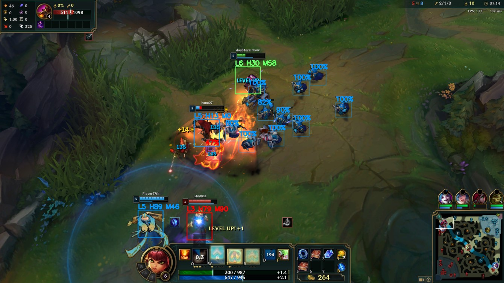
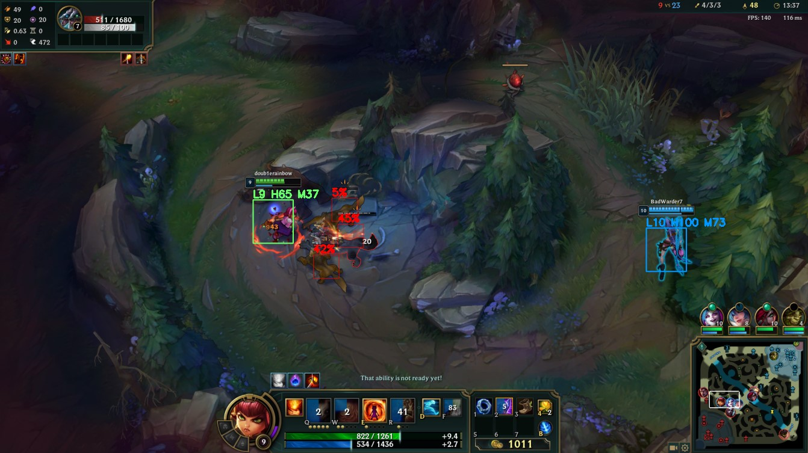
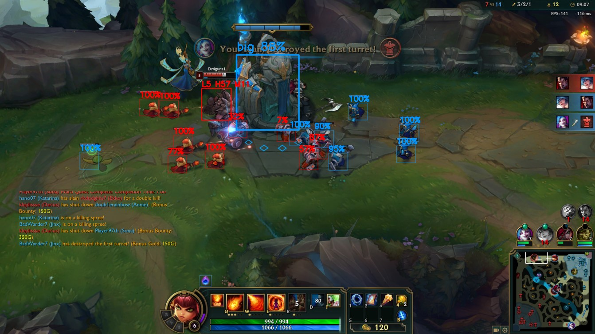
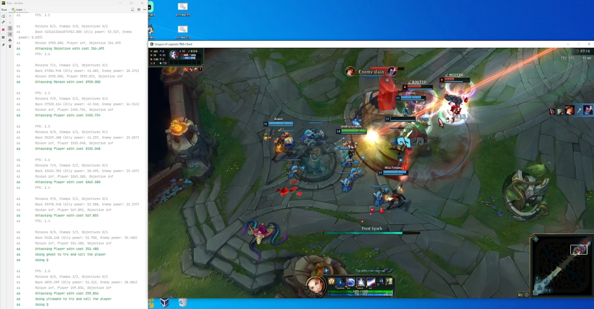
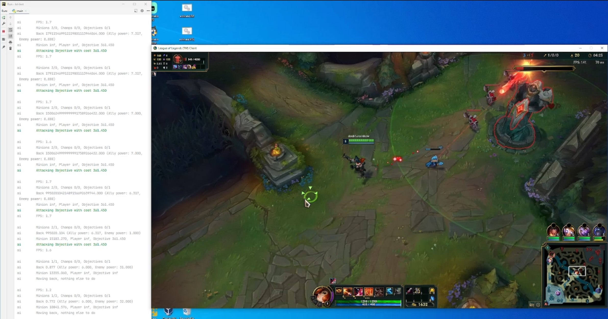

# lol-bot

LoL bot. Will boost you to Iron IV

This bot makes no attempt to stay undetected, because it's meant as a learning project. Use at your own risk.

Version 0.1.0

## Demo

Parsing the game state (minions, players, and turrets):







Playing the game using the parsed info:





## Setup

Um... yeah. Good luck with that one.

Use a virtual environment with Python 3.9 or below. Python 3.10 will not work!

Dependencies:
```shell
pip install colorlog
pip install pynput
pip install numpy
pip install matplotlib
pip install mss

# Windows specific
pip install torch==1.10.2+cu113 torchvision==0.11.3+cu113 torchaudio===0.10.2+cu113 -f https://download.pytorch.org/whl/cu113/torch_stable.html
pip install pywin32

# Mac specific (DOES NOT WORK RIGHT NOW)
pip install torchaudio
pip install --upgrade torch==1.9.0
pip install --upgrade torchvision==0.10.0

# All systems
pip install easyocr
pip uninstall opencv-python-headless
pip install opencv-python==4.5.4.60
```

## Todo

- [X] Create basic controllers
  - [X] Basic mouse movements, semi-realistic
  - [X] Basic keyboard controls
  - [X] Basic League-specific "combos" (ex: aim then press an ability)
- [X] Use vision to locate objects on the screen
  - [X] Locate champions within the camera's view, and identify their loyalty / health
  - [X] Locate turrets within the camera's view, and identify their loyalty / health
  - [X] Locate minions within the camera's view, and identify their loyalty / health
- [X] Create an AI with simple, hardcoded logic by combining vision and controllers
- [ ] Use vision to help the AI buy recommended items from the shop
- [ ] Create a simple GUI to visualize the AI's actions

### Milestones: Manual AI

  - [X] Perform a fixed coordinate combo (2/11/22)
  - [X] Perform a combo aimed at a champion (2/14/22)
  - [X] Beat Tutorial Part 1 with a positive KDA & at least 1 kill (2/14/22)
  - [X] Beat Tutorial Part 2 with a positive KDA & at least 1 kill (2/14/22)
  - [ ] Beat Tutorial Part 3 with a positive KDA & at least 3 kills

### Capstones: Manual AI

  - [ ] Win an intro Coop vs AI game with a positive KDA & at least 3 kills
  - [ ] Win a beginner Coop vs AI game with a positive KDA & at least 3 kills
  - [ ] Win a 1v1 against me in a custom game (first turret), but I have to play Yuumi mid cause why not

### Milestones: Hybrid AI

TBD
